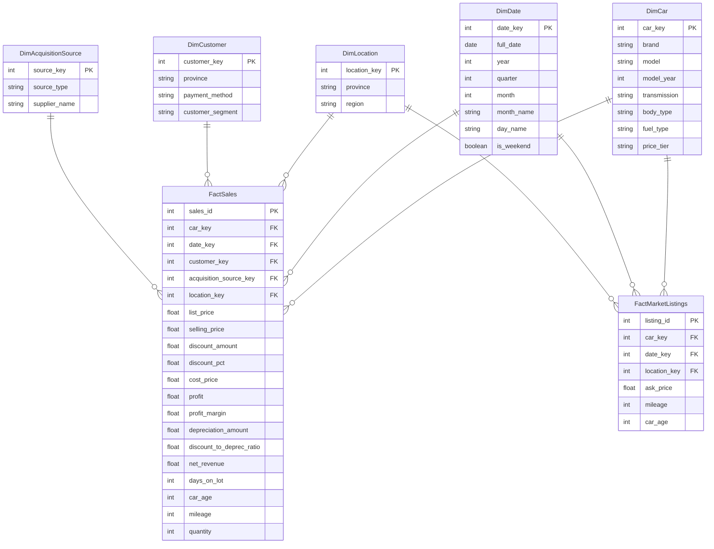

# 🚗 Used Car Analytics: Data Warehouse & Automated ETL Pipeline

ระบบคลังข้อมูล (**Data Warehouse**) แบบ **Star Schema Architecture** และกระบวนการ **Automated ETL Pipeline** สำหรับบริหารจัดการ วิเคราะห์ยอดขาย อัตรากำไร การตั้งราคาเปรียบเทียบตลาด และการค้างสต็อกของธุรกิจรถยนต์มือสอง

---

## 🎯 ปัญหาทางธุรกิจ (Business Problems)

1. **ระบุแบรนด์/รุ่นที่ทำกำไรจริงไม่ได้**: ข้อมูลราคาขาย ต้นทุน และส่วนลดกระจัดกระจายหลายระบบ
2. **ตั้งราคาขายขาดข้อมูลเปรียบเทียบตลาด**: ไม่มีข้อมูลราคากลางจากแพลตฟอร์มภายนอก (Kaidee Auto & One2car) เสี่ยงตั้งราคาสูง/ต่ำเกินไป
3. **รถค้างสต็อกนานผิดปกติ**: ขาดระบบติดตามระยะเวลาจอดค้างสต็อก (Days on Lot) ทำให้เกิดต้นทุนการถือครองสูงโดยไม่รู้ตัว
4. **ไม่ทราบความคุ้มค่าของแหล่งจัดหา**: ประเมินไม่ได้ว่าแหล่งซื้อรถ (เช่น ประมูล, รับซื้อหน้าลาน, ฟลีท) แหล่งใดให้ต้นทุนและกำไรดีที่สุด

---

## 🏛️ สถาปัตยกรรมคลังข้อมูล (Star Schema Architecture)

ระบบออกแบบคลังข้อมูลในรูปแบบ **Star Schema (2 Fact Tables + 5 Dimension Tables)** เพื่อรองรับการตอบโจทย์ธุรกิจ:



---

## 🛠️ เครื่องมือและเทคโนโลยี (Tools & Tech Stack)

* **Programming & Core Libraries**: Python 3.10+, Pandas, NumPy, Regex, SQLAlchemy
* **Database Systems**: SQLite (`used_car_dw.db`), PostgreSQL (Docker Container), Supabase Cloud PostgreSQL
* **Data Visualization & Dashboard**: Streamlit, Plotly
* **Orchestration**: Automated Pipeline Command (`run_pipeline.py`)

---

## 🔄 ขั้นตอนการทำงานของ ETL Pipeline (6 Steps)

1. **Extract (`02_ETL/src/extract.py`)**: ดึงข้อมูลดิบจาก 3 แหล่ง (Kaidee Auto JSON, One2car Multi-CSV, US Used Car Sales CSV)
2. **Clean (`02_ETL/src/clean.py`)**: สกัดอักขระและตัวเลขด้วย Regex, จัดการ Null/Price Traps, Standardize จังหวัดและประเภทตัวถัง/เชื้อเพลิง
3. **Transform (`02_ETL/src/transform.py`)**: คำนวณ KPIs ทางธุรกิจ (Profit, Margin %, Discount, Depreciation, Days on Lot, Price Tier)
4. **Integrate (`02_ETL/src/integrate.py`)**: สร้าง Surrogate Keys และประกอบตารางเป็น Star Schema (2 Fact + 5 Dimensions) พร้อมจัดกลุ่ม 6 ภูมิภาคไทย
5. **Validate (`02_ETL/src/validate.py`)**: ตรวจสอบคุณภาพข้อมูล (PK Uniqueness, FK Non-Null, Positive Selling Price, Non-negative Days on Lot)
6. **Load (`02_ETL/src/load.py`)**: โหลดข้อมูลลง SQLite, Local Docker PostgreSQL, Supabase Cloud และส่งออก CSV Backups

---

## 📁 โครงสร้างโฟลเดอร์โครงการ (Project Directory Structure)

```text
project-group/
├── 01_Raw_Data/                   # ข้อมูลดิบจาก 3 แหล่งข้อมูลหลัก
│   ├── kaidee/                    # ข้อมูลประกาศขาย Kaidee Auto (kaidee_cars_detail.json)
│   ├── one2car/                   # ข้อมูลประกาศขาย One2car (one2car-11-2.csv, 11-3.csv, 11-4.csv)
│   └── us-usecar/                 # ข้อมูลธุรกรรมการขายจริง (used_car_sales.csv)
├── 02_ETL/                        # กระบวนการและสคริปต์ ETL แบบอัตโนมัติ
│   ├── notebooks/                 # Jupyter Notebooks สำหรับทดลองและ Audit ข้อมูล
│   ├── src/                       # โมดูลสคริปต์ ETL (extract, clean, transform, integrate, validate, load)
│   └── run_pipeline.py            # สคริปต์หลักรัน ETL Pipeline ทั้งหมดอัตโนมัติ
├── 03_Data_Warehouse/             # ฐานข้อมูล Data Warehouse (SQLite DB + CSV Backups)
│   ├── used_car_dw.db             # SQLite Data Warehouse Main Database
│   ├── FactSales.csv              # Fact Table 1: ยอดขาย กำไร ส่วนลด และระยะเวลาจอดขาย
│   ├── FactMarketListings.csv     # Fact Table 2: ประกาศขายและราคากลาง One2car Market Benchmark
│   ├── DimCar.csv                 # Dimension: ข้อมูลสเปกรถยนต์
│   ├── DimDate.csv                # Dimension: มิติด้านเวลา
│   ├── DimLocation.csv            # Dimension: ทำเลจังหวัด จัดกลุ่ม 6 ภูมิภาคมาตรฐานประเทศไทย
│   ├── DimCustomer.csv            # Dimension: ข้อมูลกลุ่มลูกค้าและช่องทางการชำระเงิน
│   └── DimAcquisitionSource.csv   # Dimension: ช่องทางการจัดซื้อรถยนต์เข้าสต็อก
├── 04_Dashboard/                  # ระบบ Dashboard แสดงผลวิเคราะห์ข้อมูล
│   └── dashboard.py               # Interactive Web Dashboard พัฒนาด้วย Streamlit & Plotly
├── 05_AI_Usage_Log/               # เอกสารบันทึกการใช้งาน Generative AI
├── docker-compose.yml             # Docker Compose สำหรับ PostgreSQL 15 Data Warehouse Container
├── requirements.txt               # รายการ Python Dependencies
└── README.md                      # เอกสารคำอธิบายโครงการ
```

---

## 🚀 ขั้นตอนการติดตั้งและใช้งาน (Getting Started)

### 1. เตรียมสภาพแวดล้อม Python
```bash
# สร้างและเปิดใช้งาน Virtual Environment
python -m venv venv
source venv/bin/activate       # สำหรับ Linux/macOS
# venv\Scripts\activate        # สำหรับ Windows

# ติดตั้ง Dependencies
pip install -r requirements.txt
```

### 2. รันฐานข้อมูล Local PostgreSQL (Optional)
```bash
docker compose up -d
```

### 3. รัน ETL Pipeline แบบอัตโนมัติ
```bash
python 02_ETL/run_pipeline.py
```

### 4. เปิดใช้งาน Interactive Dashboard
```bash
streamlit run 04_Dashboard/dashboard.py
```
เข้าใช้งานได้ผ่านเบราว์เซอร์ที่ URL: `http://localhost:8501`
